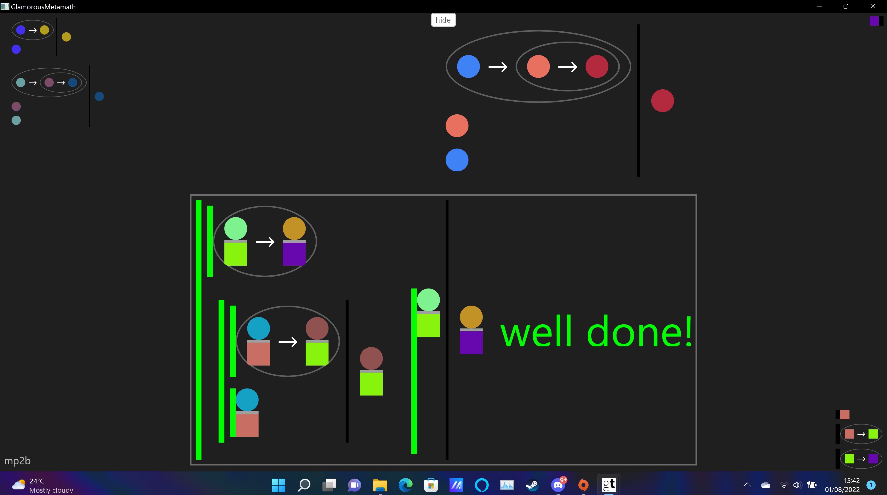
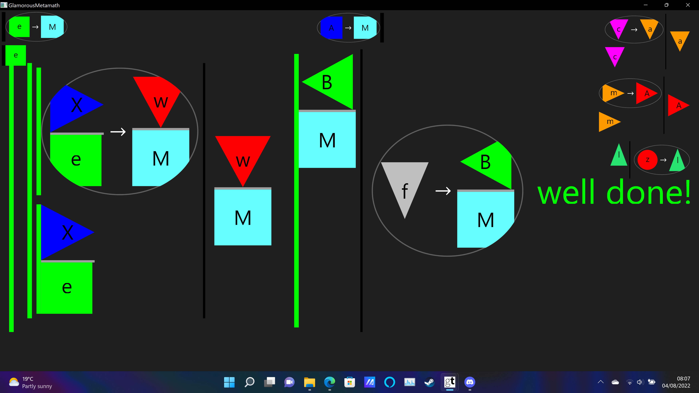

A game/GUI to teach logic.
Implemented with: GT / Pharo / Smalltalk / Metamath.


# Install
1. Get [Glamorous Toolkit](https://gtoolkit.com/).

2. Open a playground and evaluate:
```Smalltalk
Metacello new 
  baseline: 'Metamath'; 
  repository: 'github://Peter-H-Meadows/GtMetamath';
  load.
```

3. Evaluate
```Smalltalk
  Metamath open .
```


