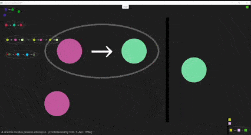

A game/GUI to teach logic.
Implemented with: GT / Pharo / Smalltalk / Metamath.





# Install
Get [Glamorous Toolkit](https://gtoolkit.com/).
then:

```Smalltalk
Metacello new 
  baseline: 'Metamath'; 
  repository: 'github://Peter-H-Meadows/GtMetamath';
  load.
  Metamath open .
```
