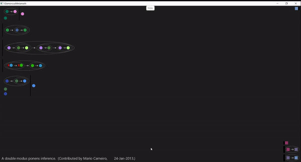
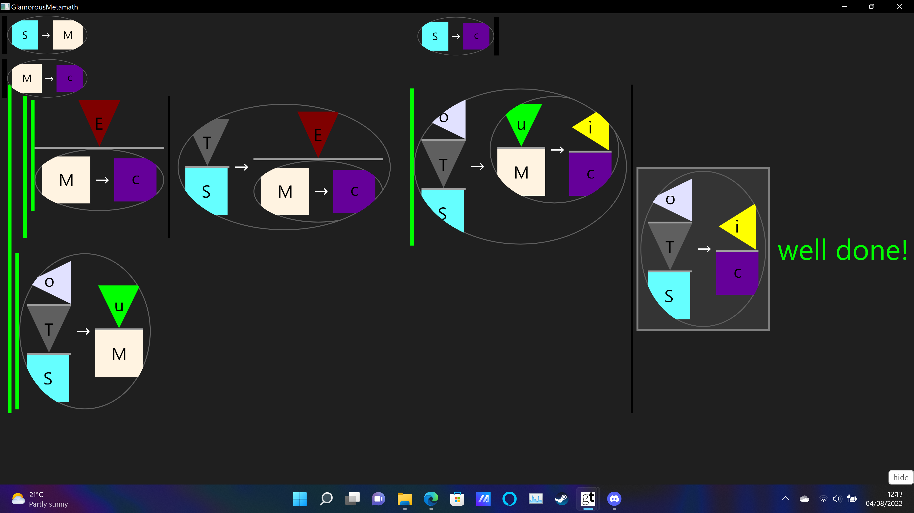

A game/GUI to teach logic.
Implemented with: GT / Pharo / Smalltalk / Metamath.




# Install
1. Get [Glamorous Toolkit](https://gtoolkit.com/).

2. Open a playground and evaluate:
```Smalltalk
Metacello new 
  baseline: 'Metamath'; 
  repository: 'github://Peter-H-Meadows/GtMetamath';
  load.
```

3. Evaluate
```Smalltalk
  Metamath new open .
```



it doesn't have a tutorial, it's just a super slow ramp of complexity, each new idea is introduced with a couple of chances to play around with it before the next one. I'd really recommend an approach like that, especially if it's for kids, the hardest thing is walls of text, generally people learn easier by playing than reading.


I think fun is key to learning! :)
(I'm sad that most schools seem to make learning mathematics boring).
"School is like going to the best restaurant in town and then being
told to eat the menu instead of the food."

>
> I've done a little game design and here's a couple of thoughts. I made this game about the four colour theorem on steam (if anyone would like to play feel free to email for a steam key).
>

Cool. I'm interested to study how my 8 year old nephew learns, so I'll
use your game as one of the tests :)

> One of the things I thought went best is that it doesn't have a tutorial, it's just a super slow ramp of complexity, each new idea is introduced with a couple of chances to play around with it before the next one. I'd really recommend an approach like that, especially if it's for kids, the hardest thing is walls of text, generally people learn easier by playing than reading.

Yep! Here is a video of the first few proofs/levels in GtMetamath.
https://youtu.be/TT5F75SK4gQ

Any feedback/thoughts?

weird words:

deduction, elimination, transposes, inference, implies, hypotheses,
assertion, antecedent, consequent, contraposition, axiom

ph implies ps = red blob links to blue blob
essential hypothesis = required input for transformer machine. and
given starting chains.
antecedent = thing at start (left-most)
consequent = thing at end (right-most)
modus ponens = detacher machine.
a1i = add-to-front machine.
syl = distributer machine.

todo: add mmj features.
  auto complete. 
  
I’m trying to decide if it would be quicker to (port to Smalltalk) or  write new code?
If MMJ code is elegant/well designed, I will spend time reading it.
If MMJ is badly designed/messy code then I guess it will be quicker just to write new code without looking at MMJ?

